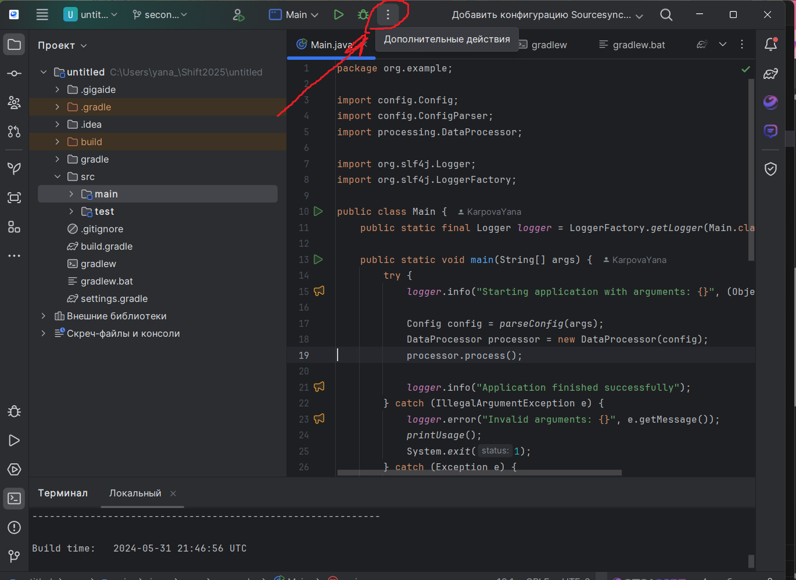
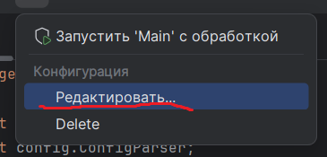
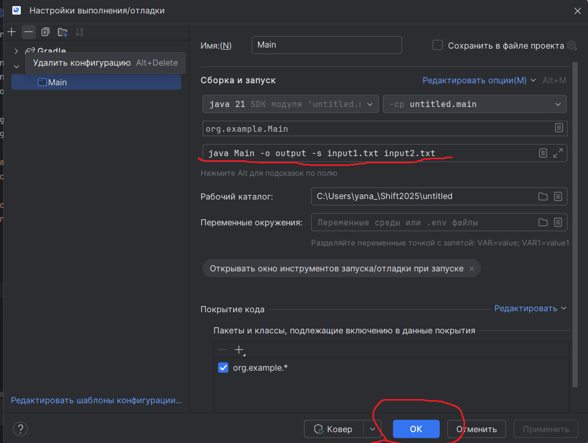
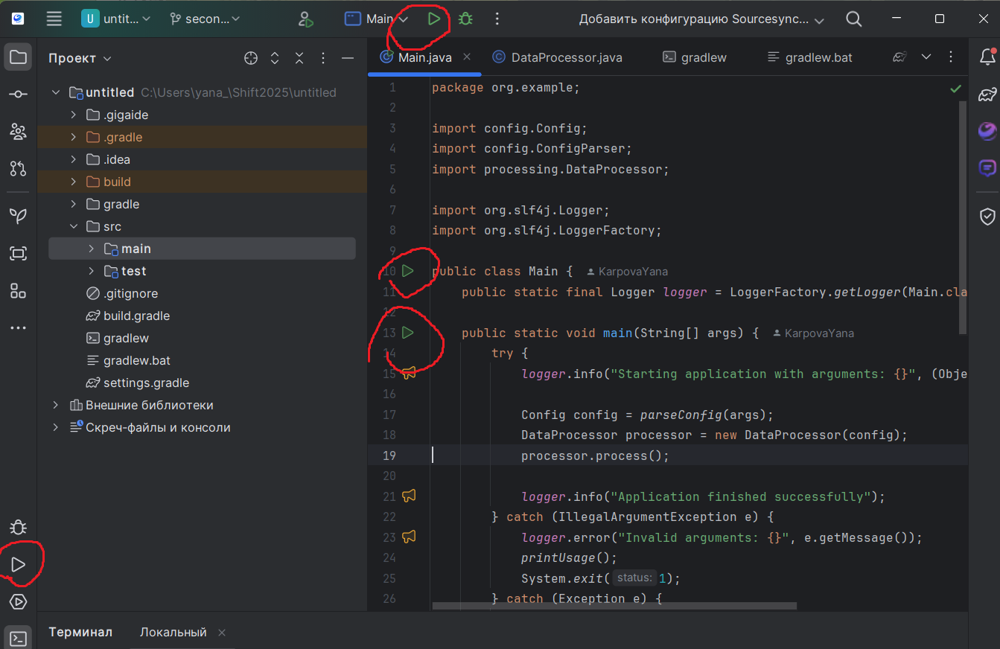

# Shift2025

# Версия Java :
openjdk version "21.0.8" 2025-07-15 LTS
OpenJDK Runtime Environment Temurin-21.0.8+9 (build 21.0.8+9-LTS)
OpenJDK 64-Bit Server VM Temurin-21.0.8+9 (build 21.0.8+9-LTS, mixed mode, sharing)

# Система сборки :
------------------------------------------------------------
Gradle 8.8
------------------------------------------------------------

Build time:   2024-05-31 21:46:56 UTC
Revision:     4bd1b3d3fc3f31db5a26eecb416a165b8cc36082

Kotlin:       1.9.22
Groovy:       3.0.21
Ant:          Apache Ant(TM) version 1.10.13 compiled on January 4 2023
JVM:          21.0.8 (Eclipse Adoptium 21.0.8+9-LTS)
OS:           Windows 11 10.0 amd64

# Особенности реализации :
- логирование
- многопоточность
- модульное тестирование

# Запуск : 
    Запуск приложения в GIGA IDE community idition

## `Шаг 1:` Открытие настроек запуска
Нажмите на кнопку конфигурации запуска:

## `Шаг 2:` Редактирование конфигурации
В выпадающем меню выберите "Редактировать...":

## `Шаг 3:` Настройка параметров
В открывшемся окне укажите:

- Основной класс (Main class)
- Аргументы командной строки\

Например :
java -jar u l.jar -s -a -p sample- in1.txt in2.txt 

## `Шаг 4:` Запуск программы
После настройки выполните запуск стандартным способом:

